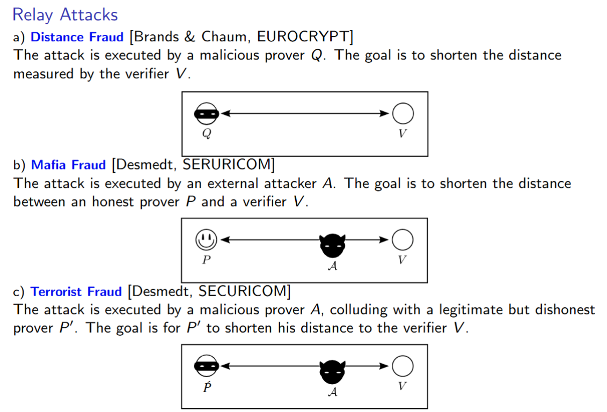
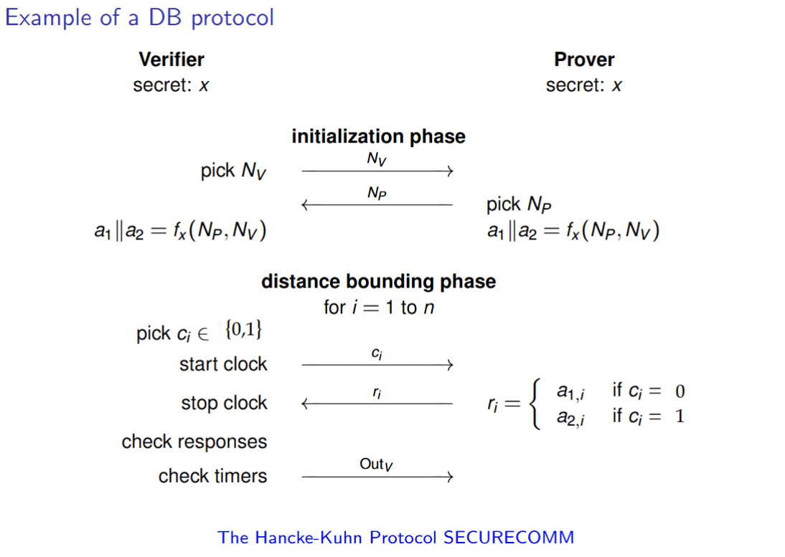
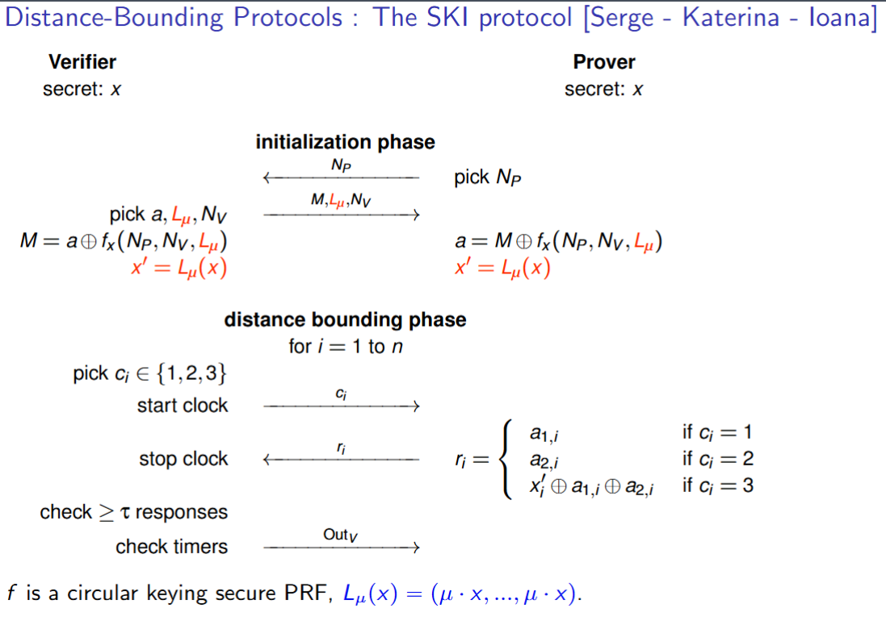

# Distance Bouding Protocols Demonstation

## Table of Contents
1. [This Repo](#this-repo)
2. [How to run](#how-to-run)
3. [Attacks](#attacks)
4. [Protocol Figures](#hs--ski)

## This Repo

This demonstation is following the lecture [slides](https://learning.unisg.ch/courses/26413/files/3925259?wrap=1) from Secure & Private Computation: Foundations of Ethical Hacking. There are 2 distance bounding protocols in this repository, one developed by Hancke and Kuhn - [HK, SECURECOMM](https://www.cl.cam.ac.uk/~mgk25/sc2005-distance.pdf) and another developed by S. Vaudenay, K. Mitrokotsa and I. Boureanu - [SKI, IACR](https://eprint.iacr.org/2015/208.pdf).

There are in total 10 different demonstations, 5 for each protocol, including:

1. [Honest Prover, within acceptable distance](#honest-prover-within-acceptable-distance)
2. [Honest Prover, outside acceptable distance](#honest-prover-outside-acceptable-distance)
3. [Distance Fraud attack](#distance-fraud-attack)
4. [Mafia Fraud attack](#mafia-fraud-attack)
5. [Terrorist Fraud attack](#terrorist-fraud-attack)

More explanations on the attacks are given later in the README. Below is the way to run each of the demonstations.

## How to run

__NOTE 1__: This demonstation runs on localhost and provides no possibility to run the code on 2 devices. Therefore, 'outside the acceptable distance' is simulated by adding a delay to the network.

__NOTE 2__: Under the folders `SKI` and `HanckeKuhn` you will find 5 identical files and a subfolder. 3 of the files, `verifier.py`, `prover.py` and `setup.py` contain the protocol definition and therefore are different. `json_utils.py` is the same and `attacks.py` only has different ports defined. - __Both locations can independently run code that simulates the same 5 experiments.__

Given Note 2, the commands to run the 5 demos are the same. If you want to run the HK protocol, set your context to be:

```console
your_user/Distance bounding demo/HanckeKuhn>
```

And for SKI protocol, your context should be:

```console
your_user/Distance bounding demo/SKI>
```

### Honest prover, within acceptable distance

---

You need __2__ consoles.

Verifier Console:

```console
python setup.py
python verifier.py
```

Prover Console:

```console
python prover.py
```

### Honest prover, outside acceptable distance

---

You need __2__ consoles.

Verifier Console:

```console
python setup.py
python verifier.py
```

Prover Console - we need to simulate distance, so we add a delay. The acceptance threshold for delays is 0.1 seconds, so any delay >= threshold should simulate the "long distance":

```console
python prover.py --delay-ms 200
```

### Distance Fraud attack

---

You need __2__ consoles.

Verifier Console:

```console
python setup.py
python verifier.py
```

Prover Console:

```console
python attacks.py df
```

### Mafia Fraud attack

---

There are 2 flavors of mafia fraud. For both, you need __3__ consoles.

In this demo, there is a man in the middle, a third party. Since, all parties need to communicate, this party will expose a new port for the Prover to connect. Depending on the protocol, the `mitm-port` value is:

- _HK_: `mitm-port=5003`
- _SKI_: `mitm-port=6003`

The final tunnel looks like:

Verifier <-> Attacker <-> Prover

We make 2 scenarios, 1 where this whole tunnel is within the acceptable distance and 1 where only the attacker is within the acceptable distance.

#### 1. Prover, Attacker in range

---

The attacker works as a relay. Because of this, __this attack always works!__

Verifier Console:

```console
python setup.py
python verifier.py
```

Man-in-the-Middle Console:

```console
python attacks.py mf_in --mf-listen mitm-port
```

Prover Console:

```console
python prover.py --port mitm-port
```

#### 2. Only Attacker in range

---

Attacker makes random guesses, __equivalent to distance fraud.__

Verifier Console:

```console
python setup.py
python verifier.py
```

Man-in-the-Middle Console:

```console
python attacks.py mf_out --mf-listen mitm-port
```

Prover Console:

```console
python prover.py --port mitm-port
```
 
### Terrorist Fraud attack

---

You need __2__ consoles.

Verifier Console:

```console
python setup.py
python verifier.py
```

Prover Console:

```console
python attacks.py tf
```

## Attacks

With the exeption of not using secure randomness generators, the code follows the protocol execution steps. This makes the SKI protocol secure against Terrorist Fraud.

For both protocols, implementations for the setup, prover and verifier are given. The `json_utils` file always provides the means of communication between distributed parties and the `attacks` folder models the following 3 attacks:

1. Distance Fraud - malicious actor tries to guess the replies to the challenges. Success rate depends on threshold for wrong replies.
2. Mafia Fraud - there are 2 versions, both with a man in the middle (attacker):
    
    2.1 Attacker and Prover are both in range: in this case, the attacker works as a relay, forwarding challenges to the prover and responses to the verifier. __This always works__
    
    2.2 Prover out of range: In this case, the attacker receives the challenges and replies with random guesses. This is equivalent to __Distance Fraud__. 
3. Terrorist Fraud - man in the middle and malicious actor collude, the man in the middle lears the setup randomness and is able to attack the HK protocol with 100% success rate.

_In this repository, the threshold for wrong replies is 0, meaning no wrong replies to challenges are tolerated by the verifier._



## HK & SKI

### Hancke & Kuhn



### SKI


